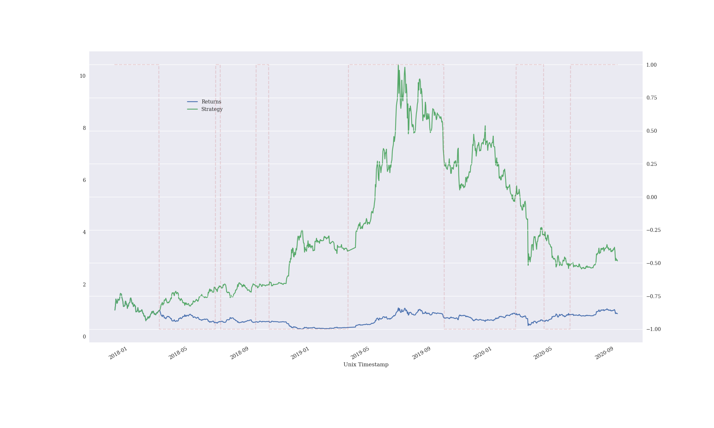

# crypto-trading
Code related to crypto trading plots etc.

## Install python 3.8.5

I recommend using [`pyenv`](https://github.com/pyenv/pyenv) or similar.

## Clone this repo

```bash
git clone git@github.com:LinuxFan2718/crypto-trading.git
```

## (Optional) Download up-to-date price data

[Bitcoin prices on the Binance exchange](https://www.cryptodatadownload.com/data/binance/)

The example code uses BTC/USD Hourly data.

A data file is included in this repo but you should download an up-to-date file.

Replace the existing `Binance_BTCUSDT_1h.csv` file with the one you download.

## Install libraries

```bash
pip install -r requirements.txt
```

## (Optional) Find optimal parameters

```bash
python find-optimal-parameters.py
```

```bash
<class 'pandas.core.frame.DataFrame'>
RangeIndex: 360 entries, 0 to 359
Data columns (total 5 columns):
 #   Column    Non-Null Count  Dtype  
---  ------    --------------  -----  
 0   SMA1      360 non-null    int64  
 1   SMA2      360 non-null    int64  
 2   MARKET    360 non-null    float64
 3   STRATEGY  360 non-null    float64
 4   OUT       360 non-null    float64
dtypes: float64(3), int64(2)
memory usage: 14.2 KB
     SMA1  SMA2    MARKET  STRATEGY       OUT
260    72   110  0.871457  3.293881  2.422424
280    76   110  0.871457  2.896210  2.024753
120    44   110  0.871457  2.639349  1.767892
220    64   110  0.871457  2.549864  1.678407
100    40   110  0.871457  2.447491  1.576034
340    88   110  0.871457  2.390531  1.519074
121    44   120  0.617730  1.956269  1.338540
```

## Run the backtester

(If you found optimal parameters use them here instead of the defaults)

```bash
python backtest-sma-strategy.py
```

```bash
Strategy outperforms buy and hold 3.32x
```



## References

[Python For Finance](https://www.amazon.com/Python-Finance-Mastering-Data-Driven-ebook/dp/B07L8NMW2P/)